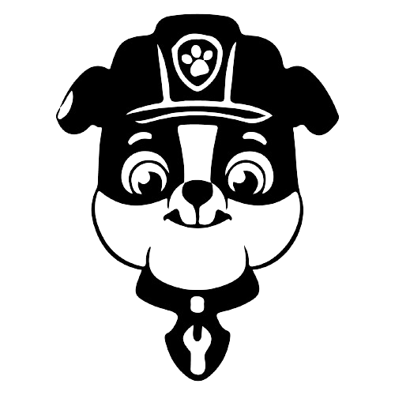
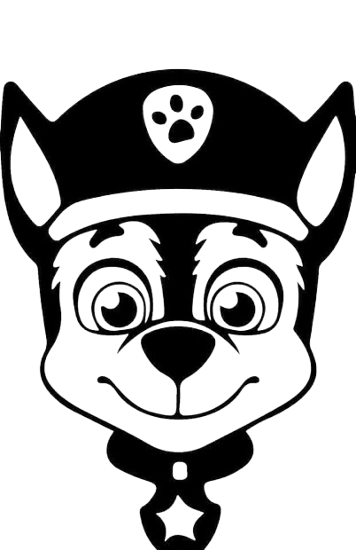
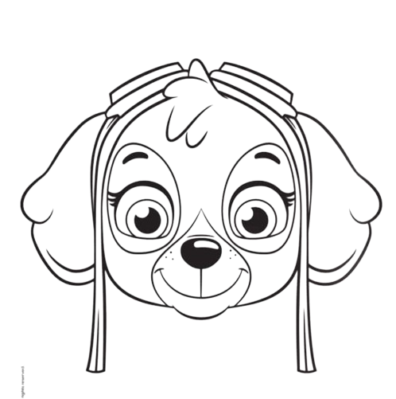

Din uppgift är att skapa en klass för husdjur, som du sedan kan ta hand om.

Skapa en klass som du kallar Pet, med egenskaperna  name, animalType, tiredness, hunger, loneliness och happiness. Namn och typ ska definieras när en instans av klassen skapas, övriga värden ska vara 50. Skapa följande tre metoder (ni får justera siffrorna efter behov):

nap - Sänker tiredness med 40, sänker happiness med 10, ökar hunger och loneliness med 10.

play - Ökar happiness med 30, ökar hunger och tiredness med 20. Sänker loneliness med 10. (Extra:Tiredness måste vara under t.ex 70 för att göra detta).

eat - Sänker hunger med 60, ökar tiredness med 10.
OBS! Sätt en maxgräns för samtliga värden, t.ex 100.

Skapa upp följande element i DOM:en med HTML:
En textinput för djurets namn
En dropdown med minst tre olika djur som alternativ
En knapp.

När användaren klickar på knappen, ska ett husdjur skapas med namnet man fyllt i samt djurarten man valt. Skapa en 
 där du skriver ut värden för alla dess egenskaper + knappar för samtliga metoder för husdjuret. (Extra): Använd till fördel <progress>-taggen för att visa ut värden t.ex hunger = 75/100. Du kan läsa om <progress> här: https://www.w3schools.com/TAgs/tag_progress.asp
Man ska kunna skapa flera husdjur.
När man använder en metod, ska det skrivas ut ett meddelande vad man gör och med vilket djur t.ex. “You played with Maya!” eller “You took a nap with Lexi” etc.  
Lägg till en bild på djuret i div:en baserat på vilken djursort man valt.
Hitta på egen funktionalitet! Din fantasi sätter gränsen :) Sätt t.ex en timer så att för varje 10 sekund, höjs samtliga värden förutom happiness med 10.

@import url('https://fonts.googleapis.com/css2?family=Orbitron:wght@400..900&display=swap');

*{
    margin: 0;
    padding: 0;
    
}
body{
    background-color:rgb(154, 183, 228);
    font-family: "Orbitron", sans-serif;
}
.btn{
    font-family: "Orbitron", sans-serif;
    background-color: rgb(134, 160, 199);
    color: white;
    border: none;
    padding: 5px;
    font-size: 1rem;
    height:100px;
    width: 100px;
    box-shadow: 0 2px 4px darkslategray;
    cursor: pointer;
    transition: all 0.2s ease;
    border-radius: 70%;
}

html pet container 

        

            

                
            

        

        

            

                
            

        

        

            

                
            

        

    
